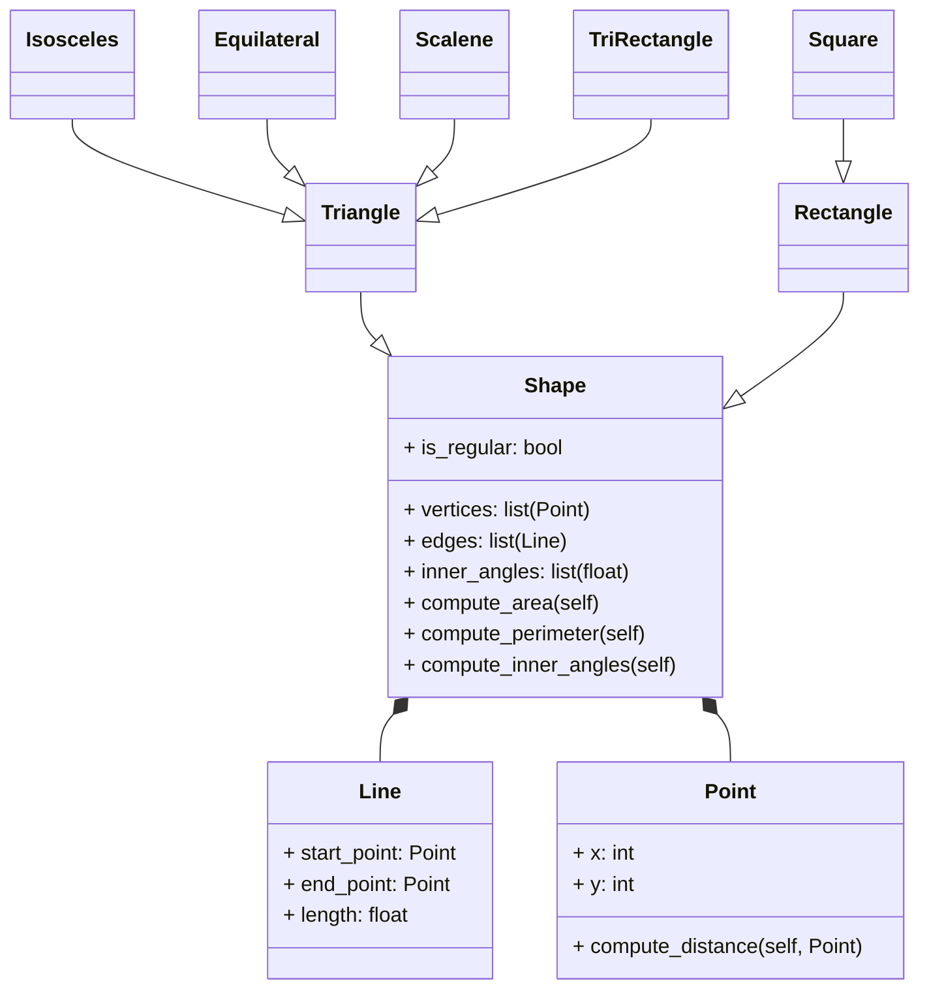

# Reto-04

En este reto se usaran las estrategias ya vistas en retos anteriores pero agregandole el uso del encapsulamiento y poliformismo. 

# Ejercicio:

1. Cree una superclase llamada Shape(), que es la base de las clases Reactangle() y Square(), defina los métodos compute_area y compute_perimeter en Shape() y luego, utilizando polimorfismo, redefina los métodos adecuadamente en Rectangle y en Square.

2. Utilizando las clases Point() y Line() defina una nueva superclase Shape() con la siguiente estructura:



Utilice herencia, composición, encapsulación y polimorfismo para definir las clases. Todos los atributos deben tener sus respectivos setters y getters.

#Codigo: 
```python
from math import sqrt, asin, acos, pi

class Point:
   def __init__(self, x: float, y: float) -> None:
      self._x = x
      self._y = y

class Line(Point):
   def __init__(self, start: Point, end: Point ) -> None:
      super().__init__(start._x, start._y)
      self._start = start
      self._end = end

   def compute_length(self) -> float:
      length = ((self._end._x - self._start._x) ** 2 + (self._end._y - self._start._y) ** 2) ** 0.5
      return length
    
   def compute_slope(self):
      # Vertical line
      if (self._end._x - self._start._x) == 0:
         return None  
      slope: float = (self._end._y - self._start._y) / (self._end._x - self._start._x)
      return slope
    
   def compute_vertical_crossing(self):
      # Intersection with y-axis (x=0)
      slope = self.compute_slope()
      if slope is None:
         return None
      crossing = self._start._y - (slope * self._start._x)  # y = mx + b  =>  b = y - mx
      return crossing

   def compute_horizontal_crossing(self):
      # Intersection with x-axis (y=0)
      slope = self.compute_slope()
      if slope == 0:
         return None  # Horizontal line has no crossing with x-axis
      if slope is None:
         return None  # Vertical line has no crossing with x-axis
      crossing = -(self._start._y - (slope * self._start._x)) / slope  # y = mx + b  =>  x = (y - b) / m
      return crossing
    
   def __str__(self) -> str:
      slope = self.compute_slope()
      slope_str = f"{slope:.2f}"
      v_cross = self.compute_vertical_crossing()
      h_cross = self.compute_horizontal_crossing()
      return (
         f"Length: {self.compute_length():.2f}, "
         f"Slope: {slope_str}, "
         f"Vertical crossing: {v_cross}, "
         f"Horizontal crossing: {h_cross}"
        )

class Shape():
   def __init__(self, is_regular: bool):
      self.is_regular = is_regular
      self.vetices: list = []
      self.edges: list = []
        
   def compute_area(self):
      return 0
    
   def compute_perimeter(self):
      if not self.edges:
            return 0
      else:
         for edge in self.edges:
            perimeter = sum(edge.compute_length() for edge in self.edges)
         return perimeter
    
   def inner_angle(self, sides: int) -> float:
      if sides < 3:
            return 0
      return (sides - 2) * 180 / sides # Average inner angle in degrees
    
   def compute_inner_angles(self):
        sides = len(self.vertices)
        if sides < 3:
            return 0
        return (sides-2) * 180

class Rectangle(Shape):
   def __init__(self, method: int, *args):
      super().__init__(is_regular = False)

      if method == 1:
         # Method 1: Bottom-left + width + height
         bottom_left, width, height = args
         self.width = width
         self.height = height
         self.center = Point(bottom_left._x + width/2, bottom_left._y + height/2)
      elif method == 2:
         # Method 2: Center + width + height
         center, width, height = args
         self.width = width
         self.height = height
         self.center = center
      elif method == 3:
         # Method 3: Two opposite points
         p1, p2 = args
         self.width = abs(p2._x - p1._x)
         self.height = abs(p2._y - p1._y)
         self.center = Point((p1._x + p2._x)/2, (p1._y + p2._y)/2)

      elif method == 4:
         # Method 4: Four lines (composition)
         l1, l2, l3, l4 = args
         lines = [l1, l2, l3, l4]

         points = []
         for line in lines:
            points.append(line._start)
            points.append(line._end)

         xs = []
         ys = []
         for p in points:
            xs.append(p._x)
            ys.append(p._y)

         min_x = min(xs)
         max_x = max(xs)
         min_y = min(ys)
         max_y = max(ys)

         self.width = max_x - min_x
         self.height = max_y - min_y
         self.center = Point((min_x + max_x) / 2, (min_y + max_y) / 2)

      else:
         return "Error: Invalid method"

   def compute_area(self):
         return self.width * self.height

   def compute_perimeter(self):
         return 2 * (self.width + self.height)

   def compute_interference_point(self, point: Point) -> bool:
        x_min = self.center._x - self.width/2
        x_max = self.center._x + self.width/2
        y_min = self.center._y - self.height/2
        y_max = self.center._y + self.height/2
        return x_min <= point._x <= x_max and y_min <= point._y <= y_max

class Square(Rectangle):
      def __init__(self, method: int, *args):
         if method == 1:
            # Method 1: Bottom-left + side
            bottom_left, side = args
            super().__init__(1, bottom_left, side, side)
         elif method == 2:
            # Method 2: Center + side
            center, side = args
            super().__init__(2, center, side, side)
         elif method == 3:
            # Method 3: Two opposite points
            p1, p2 = args
            side = max(abs(p2._x - p1._x), abs(p2._y - p1._y))
            super().__init__(2, Point((p1._x + p2._x) / 2, (p1._y + p2._y) / 2), side, side)
         else:
            raise ValueError("Error: Invalid method")
        
class Triangle(Shape):
      def __init__(self, p1: Point, p2: Point, p3: Point):
        super().__init__(is_regular=False)
        self.vertices = [p1, p2, p3]
        self.edges = [Line(p1, p2), Line(p2, p3), Line(p3, p1)]
        self.center = Point((p1._x + p2._x + p3._x) / 3, (p1._y + p2._y + p3._y) / 3)
      def compute_perimeter(self):
        return super().compute_perimeter()
    
      def compute_area(self):
        a = self.edges[0].compute_length()
        b = self.edges[1].compute_length()
        c = self.edges[2].compute_length()
        s = (a + b + c) / 2  # Semi-perimeter
        area = (s * (s - a) * (s - b) * (s - c)) ** 0.5  # Heron's formula
        return area
    
class IsoscelesTriangle(Triangle):
   def __init__(self, base_point1: Point, base_point2: Point, apex_point: Point):
      self.is_regular = False
      super().__init__(base_point1, base_point2, apex_point)
      if not (self.edges[0].compute_length() == self.edges[1].compute_length() or
               self.edges[1].compute_length() == self.edges[2].compute_length() or
               self.edges[0].compute_length() == self.edges[2].compute_length()):
            raise ValueError("Error: The provided points do not form an isosceles triangle")
    
   def compute_area(self):
      return super().compute_area()
    
   def compute_perimeter(self):
      return super().compute_perimeter()
    
   def compute_inner_angles(self):
      if self.edges[0].compute_length() == self.edges[1].compute_length():
            a = self.edges[0].compute_length()
            b = self.edges[2].compute_length()
      elif self.edges[1].compute_length() == self.edges[2].compute_length():
            a = self.edges[1].compute_length()
            b = self.edges[0].compute_length() 
      else:
            a = self.edges[0].compute_length()
            b = self.edges[1].compute_length()

      test = (b/2)/a
      angle1 = acos(test) * (180 / pi)  # Convert to degrees
      angle2 = angle1
      angle3 = 180 - 2 * angle1
      return angle1, angle2, angle3
    
class Equilateral(Triangle):
   def __init__(self, p_e1: Point, p_e2: Point, p_e3: Point):
      self.is_regular = True
      super().__init__(p_e1, p_e2, p_e3)
    
   def compute_area(self):
      return super().compute_area()
    
   def compute_perimeter(self):
      return super().compute_perimeter()
    
   def compute_inner_angles(self):
      return 60, 60, 60
        
class Scalene(Triangle):
   def __init__(self, p_s1: Point, p_s2: Point, p_s3: Point):
      self.is_regular = False
      super().__init__(p_s1, p_s2, p_s3)
      if (self.edges[0].compute_length() == self.edges[1].compute_length() or
         self.edges[1].compute_length() == self.edges[2].compute_length() or
         self.edges[0].compute_length() == self.edges[2].compute_length()):
         raise ValueError("Error: The provided points do not form a scalene triangle")
    
   def compute_area(self):
      return super().compute_area()
    
   def compute_perimeter(self):
      return super().compute_perimeter()
    
   def compute_inner_angles(self):
      a = self.edges[0].compute_length()
      b = self.edges[1].compute_length()
      c = self.edges[2].compute_length()

      angle1 = acos((b**2 + c**2 - a**2) / (2 * b * c)) * (180 / pi)  # Convert to degrees
      angle2 = acos((a**2 + c**2 - b**2) / (2 * a * c)) * (180 / pi)
      angle3 = 180 - angle1 - angle2
      return angle1, angle2, angle3

if __name__ == "__main__":
   p1 = Point(1, 1)
   p2 = Point(4, 8)
   p3 = Point(5, 4)
   p4 = Point(0, 4)
   base_point1 = Point(0, 0)
   base_point2 = Point(4, 0)
   apex_point = Point(2, 3)
   p_e1 = Point(0, 0)
   p_e2 = Point(4, 0)
   p_e3 = Point(2, (4 * (3 ** 0.5)) / 2)  # Height of equilateral triangle with side 4
   p_s1 = Point(0, 0)
   p_s2 = Point(4, 0)
   p_s3 = Point(3, 5)

   # Create 4 lines that form a rectangle
   l1 = Line(p1, p2)
   l2 = Line(p2, p3)
   l3 = Line(p3, p4)
   l4 = Line(p4, p1)

   print("Test Rectangle")

   # Method 1: Bottom-left + width + height
   rect1 = Rectangle(1, Point(0, 0), 4, 3)
   print("Method 1 -> Area:", rect1.compute_area(), 
      "Perimeter:", rect1.compute_perimeter(), 
      "Center:", (rect1.center._x, rect1.center._y), 
      "inner Angle:", rect1.inner_angle(4))

   # Method 2: Center + width + height
   rect2 = Rectangle(2, Point(2, 1.5), 4, 3)
   print("Method 2 -> Area:", rect2.compute_area(), 
      "Perimeter:", rect2.compute_perimeter(), 
      "Center:", (rect2.center._x, rect2.center._y), 
      "Inner Angle:", rect2.inner_angle(4))

   # Method 3: Two opposite points
   rect3 = Rectangle(3, Point(0, 0), Point(4, 3))
   print("Method 3 -> Area:", rect3.compute_area(), 
      "Perimeter:", rect3.compute_perimeter(), 
      "Center:", (rect3.center._x, rect3.center._y), 
      "inner Angle:", rect3.inner_angle(4))

   # Method 4: Four lines
   rect4 = Rectangle(4, l1, l2, l3, l4)
   print("Method 4 -> Area:", rect4.compute_area(), 
      "Perimeter:", rect4.compute_perimeter(), 
      "Center:", (rect4.center._x, rect4.center._y), 
      "Inner Angle:", rect4.inner_angle(4))

   # Test point interference
   inside = Point(2, 2)
   outside = Point(5, 5)
   print("Point (2,2) inside rect4?", rect4.compute_interference_point(inside))
   print("Point (5,5) inside rect4?", rect4.compute_interference_point(outside))


   print("\nTest Square")

   # Method 1: Bottom-left + side
   sq1 = Square(1, Point(0, 0), 4)
   print("Square Method 1 -> Area:", sq1.compute_area(), 
      "Perimeter:", sq1.compute_perimeter(), 
      "Center:", (sq1.center._x, sq1.center._y),
      "Inner Angle:", sq1.inner_angle(4))

   # Method 2: Center + side
   sq2 = Square(2, Point(2, 2), 4)
   print("Square Method 2 -> Area:", sq2.compute_area(), 
      "Perimeter:", sq2.compute_perimeter(), 
      "Center:", (sq2.center._x, sq2.center._y), 
      "Inner Angle:", sq2.inner_angle(4))

   # Method 3: Two opposite points (will adjust to square)
   sq3 = Square(3, Point(0, 0), Point(4, 2))
   print("Square Method 3 -> Area:", sq3.compute_area(), 
      "Perimeter:", sq3.compute_perimeter(), 
      "Center:", (sq3.center._x, sq3.center._y), 
      "Inner Angle:", sq3.inner_angle(4))


   print("\nTest Isosceles Triangle")
   iso_tri = IsoscelesTriangle(base_point1, base_point2, apex_point)
   print(f"Isosceles Triangle -> Area: {iso_tri.compute_area():.2f} Perimeter: {iso_tri.compute_perimeter():.2f}")
   angles = iso_tri.compute_inner_angles()
   angles_str = ", ".join(f"{angle:.2f}°" for angle in angles)
   print(f"Center: {(iso_tri.center._x, iso_tri.center._y)} Inner Angles: {angles_str}")

   print("\nTest Equilateral Triangle")
   eq_tri = Equilateral(p_e1, p_e2, p_e3)
   print(f"Equilateral Triangle -> Area: {eq_tri.compute_area():.2f} Perimeter: {eq_tri.compute_perimeter():.2f}")
   angles_eq = eq_tri.compute_inner_angles()
   angles_eq_str = ", ".join(f"{angle:.2f}°" for angle in angles_eq)
   print(f"Center: {(eq_tri.center._x, eq_tri.center._y)} Inner Angles: {angles_eq_str}")

   print("\nTest Scalene Triangle")
   scal_tri = Scalene(p_s1, p_s2, p_s3)
   print(f"Scalene Triangle -> Area: {scal_tri.compute_area():.2f} Perimeter: {scal_tri.compute_perimeter():.2f}")
   angles_sc = scal_tri.compute_inner_angles()
   angles_sc_str = ", ".join(f"{angle:.2f}°" for angle in angles_sc)
   print(f"Center: {(scal_tri.center._x, scal_tri.center._y)} Inner Angles: {angles_sc_str}")
```

# Reto - 04: 
1. Incluya el ejercicio de clase en el repositorio.
2. **El restaurante reinterpretado**
- Agregue establecedores y captadores a todas las subclases para el elemento del menú
- Anular calculate_total_price() según la composición del pedido (por ejemplo, si el pedido incluye un plato principal, aplicar algún descuento en bebidas)
- Agregue la clase Pago() siguiendo el ejemplo de la clase.

# Codigo:
```python
class MenuItem:
    # Clase base para todos los items del menú.
    
    def __init__(self, nombre: str, precio: float):
        self._nombre = nombre
        self._precio = precio

    def get_name(self) -> str:
        return self._nombre

    def get_price(self) -> float:
        return self._precio
    
    def set_name(self, nombre: str) -> None:
        self._nombre = nombre

    def set_price(self, precio: float) -> None:
        self._precio = precio  
    
    def get_total(self) -> float:
        # Calcular precio total para este item.
        return self._precio
    
    def __str__(self) -> str:
        return f"{self._nombre}: ${self._precio:.2f}"

class Bebida(MenuItem):
    # Bebida con opción de tamaño.
    
    def __init__(self, nombre: str, precio: float, tamaño: str = "regular") -> None:
        super().__init__(nombre, precio)
        self._tamaño = tamaño
        
        # Ajustar
        #  precio basado en el tamaño
        if tamaño == "pequeño":
            self._precio = precio * 0.8
        elif tamaño == "grande":
            self._precio = precio * 1.3

    def get_tamaño(self) -> str:
        return self._tamaño

    def set_tamaño(self, tamaño: str):
        self._tamaño = tamaño
    
    def __str__(self) -> str:
        return f"{self._nombre} ({self._tamaño}): ${self._precio:.2f}"

class Entrada(MenuItem):
    # Entradas con opción para compartir.
    
    def __init__(self, nombre: str, precio: float, compartido: bool = False):
        super().__init__(nombre, precio)
        self._compartido = compartido
    
    def get_compartido(self) -> bool:
        return self._compartido

    def set_compartido(self, compartido: bool) ->None :
        self._compartido = compartido

    def __str__(self) -> str:
        info_compartir = " (para compartir)" if self._compartido else ""
        return f"{self._nombre}{info_compartir}: ${self._precio:.2f}"

class PlatoPrincipal(MenuItem):
    # plato principal con tipo de proteína.
    
    def __init__(self, nombre: str, precio: float, proteina: str):
        super().__init__(nombre, precio)
        self._proteina = proteina

    def get_proteina(self) ->str:
        return self._proteina
    
    def set_proteina(self, proteina: str) ->None:
        self._proteina = proteina
    
    def __str__(self) -> str:
        return f"{self._nombre} ({self._proteina}): ${self._precio:.2f}"

class Pedido:
    
    def __init__(self, numero_mesa: int):
        self._numero_mesa = numero_mesa
        self.items = []

    def get_numero_mesa(self) ->int:
        return self._numero_mesa
    
    def set_numero_mesa(self, numero_mesa: int) ->None:
        self._numero_mesa = numero_mesa
    
    def agregar_item(self, item: MenuItem) -> None:
        self.items.append(item)
    
    def get_subtotal(self) -> float:
        # Calcular subtotal antes de descuentos.
        return sum(item.get_total() for item in self.items)
    
    def aplicar_descuento(self, subtotal: float) -> tuple:
        """
        Aplicar descuentos basados en la composición del pedido.
        Retorna: (monto_descuento, razon_descuento)
        """
        # Verificar descuento de bebida (bebida gratis por pedido de mas de $25)
        tiene_plato_principal = any(isinstance(item, PlatoPrincipal) for item in self.items)
        contador_bebidas = sum(1 for item in self.items if isinstance(item, Bebida))
        
        if tiene_plato_principal and subtotal > 25 and contador_bebidas > 0:
            # Encontrar la bebida más barata
            bebidas = [item for item in self.items if isinstance(item, Bebida)]
            if bebidas:
                bebida_mas_barata = min(bebidas, key=lambda x: x._precio)
                return bebida_mas_barata._precio, "Bebida gratis por pedido de mas de $25"
        
        return 0.0, "No se aplicó descuento"
    
    def get_total(self) -> float:
        # Calcular total final después de descuentos.
        subtotal = self.get_subtotal()
        monto_descuento, razon_descuento = self.aplicar_descuento(subtotal)
        return subtotal - monto_descuento
    
    def mostrar_factura(self) -> None:
        # Mostrar la factura formateada.
        print(f"\n{'='*50}")
        print(f"MESA {self._numero_mesa} - FACTURA FINAL")
        print(f"{'='*50}")
        
        for i, item in enumerate(self.items, 1):
            print(f"{i:2d}. {item}")
        
        subtotal = self.get_subtotal()
        monto_descuento, razon_descuento = self.aplicar_descuento(subtotal)
        propina = subtotal * 0.05  # 5% de propina
        total_final = subtotal - monto_descuento + propina
        
        print(f"\n{'='*50}")
        print(f"Subtotal: ${subtotal:.2f}")
        if monto_descuento > 0:
            print(f"Descuento: -${monto_descuento:.2f} ({razon_descuento})")
        print(f"propina (5%): ${propina:.2f}")
        print(f"{'-'*50}")
        print(f"TOTAL: ${total_final:.2f}")
        print(f"{'='*50}")


class MetodoDePago:
    def pago(self, monto:float):
        raise NotImplementedError("Metodo de pago no disponible")
    
class PagEnEfectivo(MetodoDePago):
    def __init__(self, dinero_entregado: float):
        super().__init__()
        self.dinero_entregado = dinero_entregado

    def pago(self, monto):
        if self.dinero_entregado >= monto:
            print(f"Pago en efectivo realizado. Cambio: ${self.dinero_entregado - monto:.2f}")
        else:
            print(f"fondos insuficiente. falta ${monto - self.dinero_entregado:.2f}")

class PagoConTarjeta(MetodoDePago):
    def __init__(self, numero_de_tarjeta: str, cvv: int):
        super().__init__()
        self.__numero_de_tarjeta = numero_de_tarjeta
        self.__cvv = cvv

    def pago(self, monto: float):
        print(f"Pagando ${monto:.2f} con la tarjete terminada en {self.__numero_de_tarjeta[-4:]}")


def crear_menu():
    menu = [
        # Bebidas
        Bebida("Coca-Cola", 2.50, "regular"),
        Bebida("Té Helado", 2.25, "regular"),
        Bebida("Café", 2.00, "regular"),
        Bebida("Jugo de Naranja Natural", 4.50, "grande"),
        Bebida("Agua Mineral", 1.50, "pequeño"),
        
        # Entradas
        Entrada("Palitos de Mozzarella", 8.99),
        Entrada("Alitas de Pollo", 12.99, True),
        Entrada("Pan de Ajo", 5.99),
        Entrada("Nachos", 10.99, True),
        Entrada("Sopa del Día", 6.99),
        
        # Platos Principales
        PlatoPrincipal("Salmón a la Parrilla", 22.99, "salmón"),
        PlatoPrincipal("Filete Ribeye", 28.99, "res"),
        PlatoPrincipal("Pollo a la Parmesana", 18.99, "pollo"),
        PlatoPrincipal("Pasta Vegetariana", 16.99, "vegetariano"),
        PlatoPrincipal("Hamburguesa BBQ", 15.99, "res"),
        PlatoPrincipal("Ensalada César", 12.99, "pollo"),
        PlatoPrincipal("Lasagna", 17.99, "res"),
        PlatoPrincipal("Pescado del Día", 24.99, "pescado")
    ]
    return menu

def mostrar_menu(menu):
    """Mostrar el menú disponible."""
    print(f"\n{'='*40}")
    print("MENÚ DEL RESTAURANTE")
    print(f"{'='*40}")
    
    print("\n--- BEBIDAS ---")
    for i, item in enumerate(menu[:5], 1):
        print(f"{i:2d}. {item}")
    
    print("\n--- ENTRADAS ---")
    for i, item in enumerate(menu[5:10], 6):
        print(f"{i:2d}. {item}")
    
    print("\n--- PLATOS PRINCIPALES ---")
    for i, item in enumerate(menu[10:], 11):
        print(f"{i:2d}. {item}")

def demo_sistema():
    # Crear menú
    menu = crear_menu()
    
    # Mostrar menú disponible
    mostrar_menu(menu)
    
    # Crear un pedido de ejemplo
    pedido1 = Pedido(numero_mesa=5)

    # Agregar items al pedido (simulando una orden real)
    pedido1.agregar_item(menu[5])   # Palitos de Mozzarella
    pedido1.agregar_item(menu[6])   # Alitas de Pollo (compartido)
    pedido1.agregar_item(menu[10])  # Salmón a la Parrilla
    pedido1.agregar_item(menu[0])   # Coca-Cola
    pedido1.agregar_item(menu[4])   # Agua mineral
    pedido1.agregar_item(menu[15])  # Ensalada César
    
    pedido1.mostrar_factura()

    #pago en efectivo
    total = pedido1.get_total()
    Pago_Efectivo = PagEnEfectivo(70)
    Pago_Efectivo.pago(total)

    print(f"\n{'='*50}")

    #pago con tarjeta
    Pago_tarjeta = PagoConTarjeta("284303484336" , 7520 )
    Pago_tarjeta.pago(total)

    print(f"\n{'='*50}")

demo_sistema()
```
